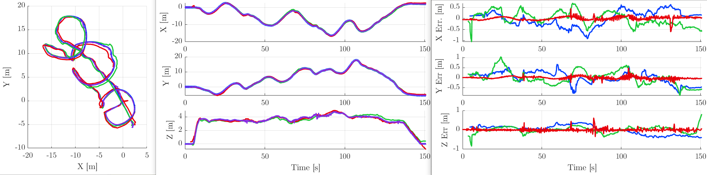
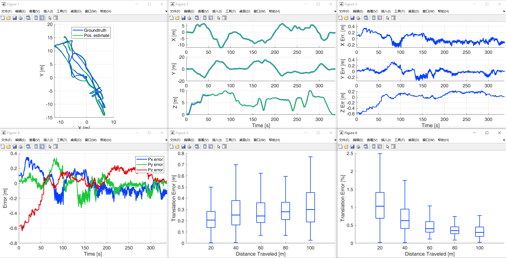
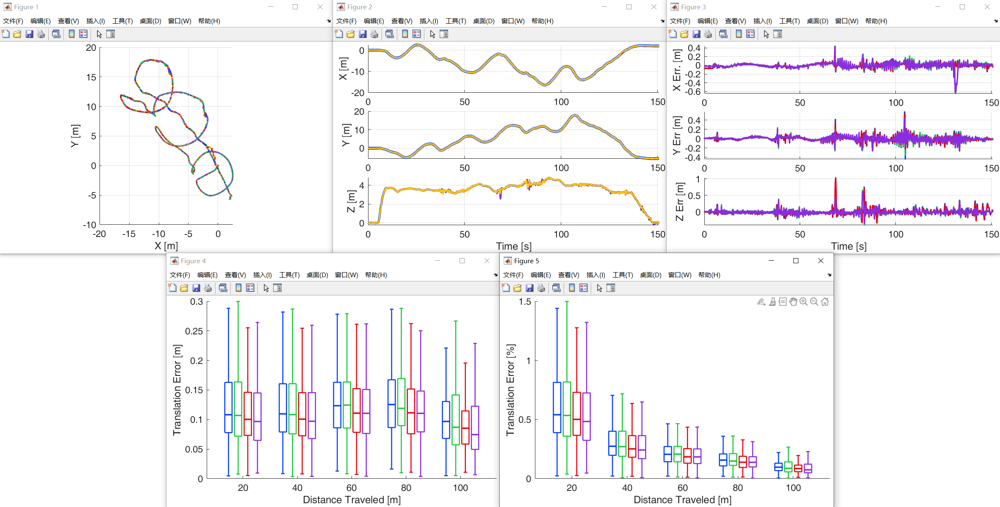

# traj_eval
Matlab scripts to calculate the absolute and relative estimation errors. This repository is modified from [ntu_viral](https://github.com/ntu-aris/viral_eval).

You can find the instruction for usage at [web page](https://ntu-aris.github.io/ntu_viral_dataset/evaluation_tutorial.html)

## Prerequisite

- Aerospace Toolbox (**quatmultiply()** required)
- Navigation/Robotics System/UAV Toolbox (**rotm2quat()** required)
- Statistics and Machine Learning Toolbox (**grp2idx()** required)

## Some demo
- evaluate one method on different datasets, refer [here](./demo_one_method/demo_datasets_one_method.m)
- evaluate multiple methods on different datasets, refer [here](./demo_multi_methods/demo_datasets_multi_methods.m)

## Format conversion for evaluation
For converting the suitable format to process, you can edit your script just as those in [this directory](./fmtconv/).

## Welcome to try new support for multiple methods [evaluate_multi_methods](eval/evaluate_multi_methods.m)

## Welcome to try new support with rpe [evaluate_one_method](eval/evaluate_one_method.m.m)

## Welcome to try new support with rpe for multiple methods [evaluate_multi_methods](eval/evaluate_multi_methods.m)

# Acknowledgement

[daboxplot_demo](daboxplot_demo.m) and [daboxplot](daboxplot.m) by Povilas Karvelis <karvelis.povilas@gmail.com>
